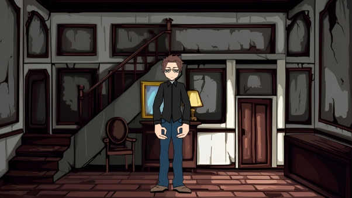
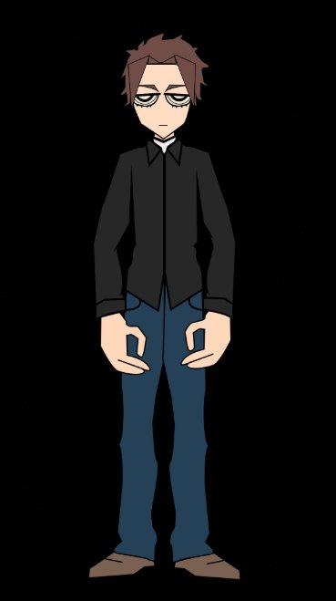
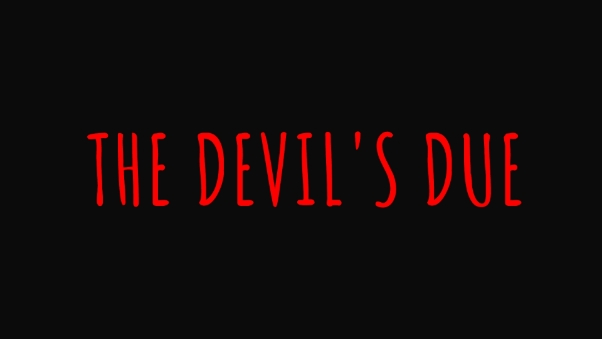

# **Fase 1: Proyecto Arte 2D - Propuesta de Videojuego** 
**Temática y Estilo Artístico:** 

- **Temática:** Terror psicológico con elementos de misterio y ocultismo. 
- **Estilo Artístico:** El estilo artístico del proyecto en general es caricaturesco y estilizado, con influencias del arte digital en 2D. Los elementos visuales se caracterizan por líneas gruesas y definidas que delimitan las formas, lo que otorga un aspecto limpio y claro. Los colores son planos, con sombreados simples que añaden profundidad sin complicar demasiado la composición. La ambientación evoca una atmósfera oscura y decadente 

## Definición del Juego:** 

- **Título Propuesto:** "The Devil's Due" 
- **De qué va el juego:** El jugador controla a Ethan Carter, un hombre atormentado por la culpa y el insomnio, quien hereda la decrépita casa de su abuela con la esperanza de venderla para saldar deudas. Sin embargo, desde su primera noche, una presencia siniestra comienza a manifestarse, revelando un oscuro secreto familiar ligado a un pacto demoníaco. Ethan deberá enfrentarse a los horrores de la casa y encontrar una manera de romper la maldición antes de ser consumido por el demonio Azazel. 
- **Historia:** Ethan Carter, consumido por la culpa y el insomnio, hereda la vieja y aislada casa de su abuela, ubicada en las afueras de un pueblo olvidado. Desesperado por el dinero de la venta para escapar de su pasado, Ethan llega a la casa sin saber el terror que le espera. Desde la primera noche, fenómenos inexplicables perturban su estancia: sonidos extraños, sombras fugaces y un frío constante invaden la atmósfera. Inicialmente, Ethan intenta racionalizar estos eventos, atribuyéndolos al estrés y a su imaginación. No obstante, la intensidad de los incidentes aumenta progresivamente, sumiéndolo en un estado de creciente ansiedad. Una noche, mientras explora el desván polvoriento, Ethan descubre un viejo diario oculto en un cofre. El diario pertenece a su bisabuelo, un hombre obsesionado con lo oculto que realizó un ritual para obtener poder a cambio de un pacto con una entidad demoníaca. Las escalofriantes páginas describen los horrores que siguieron al pacto, la gradual posesión de la casa y la locura que finalmente consumió 

  al bisabuelo. Ethan comprende entonces la aterradora verdad: la presencia que siente no es un simple fantasma, sino algo mucho más maligno: Azazel, un demonio ancestral ligado a la casa por el pacto de su antepasado. El demonio ha permanecido latente durante generaciones, esperando el momento oportuno para liberarse en el mundo mortal. La llegada de Ethan, un descendiente directo, ha despertado a la bestia. Con el avance de la noche, la casa se transforma en un laberinto de terror. Objetos se mueven por sí solos, puertas se cierran violentamente, susurros guturales parecen emanar de las paredes. Ethan deberá explorar las oscuras y claustrofóbicas habitaciones, resolver acertijos basados en las aterradoras revelaciones del diario y encontrar una manera de romper el pacto demoníaco antes de que Azazel lo consuma por completo, arrastrándolo a la locura y la oscuridad eterna. 

## **Personajes:** 
- **Ethan Carter:** El protagonista. Un hombre atormentado y desesperado que se enfrenta a los horrores de la casa.

- **Azazel:** El antagonista. Un antiguo y poderoso demonio ligado a la casa por un pacto de sangre. Se manifestará a través de fenómenos paranormales y quizás de forma física en momentos clave. 

**Escenario:** 

El escenario se compone de dos partes unidas, representando el interior de la vieja casa: 

1. **Planta Baja:** Incluye la entrada, el salón, la cocina, un estudio y quizás un sótano oscuro. Cada habitación estará llena de detalles que sugieren el paso del tiempo y la presencia siniestra. 
1. **Planta Alta:** Contiene los dormitorios, un baño y el desván polvoriento donde Ethan encuentra el diario. Esta zona estará aún más deteriorada y cargada de una atmósfera opresiva. 

## **Diseño de Personaje y Logotipo:** 
- **Personaje (Ethan Carter):**  ****

Descripción visual: Un hombre de mediana edad con rostro cansado y demacrado, ojeras pronunciadas y vestimenta informal. 

**Logotipo:** 

Descripción: El logo presenta un diseño minimalista con un fondo completamente negro y el texto "THE DEVIL'S DUE" en letras mayúsculas de color rojo brillante. La tipografía es estilizada, con trazos irregulares que le otorgan un aspecto inquietante y temático, evocando una atmósfera de misterio o terror. El contraste entre el texto rojo y el fondo negro refuerza la sensación de dramatismo y oscuridad. 

[**Trailer del videojuego**](https://youtu.be/SJTNXz9sqM8)

Es un trailer simple, con una breve introducción a la historia y demostrando un poco de toques de terror y el estilo gráfico sin entrar en detalles de la historia, intenta ser llamativo para que la gente se lleve una impresión del juego para que lo juegue sin saber ningún secreto del juego. 
## **Elementos utilizados:** 

<table><tr><th colspan="1" valign="top">Fuente de letra logo </th><th colspan="1" valign="top">Amatic SZ </th><th colspan="1">SIL OPEN FONT LICENSE Version 1.1 </th><th colspan="1" valign="top">ttf </th><th colspan="1">Codec</th></th><th colspan="1">Formato web</th></tr>
<tr><td colspan="1">Pisada sobre concrete con ambiente de ciudad </td><td colspan="1" valign="top">walking-on-co ncrete-path-13 9032 </td><td colspan="1" valign="top">Pixabay </td><td colspan="1" valign="top">mp3 </td><td colspan="1" valign="top">MPEG-2 Layer 3 </td><td colspan="1" valign="top"></td></tr>
<tr><td colspan="1" valign="top">Ambiente de noche </td><td colspan="1" valign="top">night-ambienc e-29548 </td><td colspan="1" valign="top">Pixabay </td><td colspan="1" valign="top">mp3 </td><td colspan="1" valign="top">MPEG-2 Layer 3 </td><td colspan="1" valign="top"></td></tr>
<tr><td colspan="1" valign="top">Sonido de puerta abriendose </td><td colspan="1" valign="top">door-opening- and-squeaking -104485 </td><td colspan="1" valign="top">Pixabay </td><td colspan="1" valign="top">mp3 </td><td colspan="1" valign="top">MPEG-2 Layer 3 </td><td colspan="1" valign="top"></td></tr>
<tr><td colspan="1" valign="top">Sonido puerta cerrandose </td><td colspan="1" valign="top">door-close-799 21 </td><td colspan="1" valign="top">Pixabay </td><td colspan="1" valign="top">mp3 </td><td colspan="1" valign="top">MPEG-2 Layer 3 </td><td colspan="1" valign="top"></td></tr>
<tr><td colspan="1" rowspan="2" valign="top">Música trailer </td><td colspan="1" rowspan="2" valign="top">Epic Dark Mysterious Music (Copyright and Royalty Free) "Black Fingerprint" </td><td colspan="1" valign="bottom">
Atribucion (Dylan Owen) [Video](https://www.youtube.com/watch?v=Uk5zngU-aAE) 

[Perfil fiverr](https://www.fiverr.com/share/Yo3E6p)
</td><td colspan="1" rowspan="2" valign="top">mp3 </td><td colspan="1" rowspan="2" valign="top">MPEG-2 Layer 3 </td><td colspan="1" valign="top"></td></tr>
<tr><td colspan="1"></td></tr>
<tr><td colspan="1" valign="top">Switch de luz </td><td colspan="1" valign="top">light-switch-15 6813 </td><td colspan="1" valign="top">Pixabay </td><td colspan="1" valign="top">mp3 </td><td colspan="1" valign="top">MPEG-2 Layer 3 </td><td colspan="1" valign="top"></td></tr>
<tr><td colspan="1" valign="top">Pasos interior </td><td colspan="1" valign="top">indoor-footstep s-6385</td><td colspan="1" valign="top">Pixabay </td><td colspan="1" valign="top">mp3 </td><td colspan="1" valign="top">MPEG-2 Layer 3 </td><td colspan="1" valign="top"></td></tr>
<tr><td colspan="1" valign="top">Zapping sonido </td><td colspan="1" valign="top">tv-static-noise- 291374 </td><td colspan="1" valign="top">Pixabay </td><td colspan="1" valign="top">mp3 </td><td colspan="1" valign="top">`MPEG-2 Layer 3 </td><td colspan="1" valign="top"></td></tr>
<tr>
  <td colspan="1" valign="top">Sonido paranormal 1</td>
  <td colspan="1" valign="top">paranormal-horror-sound-effect-1-vol-003-172827</td>
  <td colspan="1" valign="top">Pixabay</td>
  <td colspan="1" valign="top">mp3</td>
  <td colspan="1" valign="top">MPEG-2 Layer 3</td>
  <td colspan="1" valign="top"></td>
</tr>
<tr>
  <td colspan="1" valign="top">Sonido suspense</td>
  <td colspan="1" valign="top">fx-suspenseful-flute-inspired-background-sound-effect-277437</td>
  <td colspan="1" valign="top">Pixabay</td>
  <td colspan="1" valign="top">mp3</td>
  <td colspan="1" valign="top">MPEG-2 Layer 3</td>
  <td colspan="1" valign="top"></td>
</tr>
<tr>
  <td colspan="1" valign="top">Imagenes de fondo y personajes</td>
  <td colspan="1" valign="top">Archivos en assets</td>
  <td colspan="1" valign="top">Generadas por IA, situacion compleja de licencias, intentar no infligir derechos de terceros</td>
  <td colspan="1" valign="top">.jpeg, .png, personaje vectorizado en personaje.psd</td>
  <td colspan="1" valign="top"></td>
  <td colspan="1" valign="top">AVIF, PNG, JPG, WEBP</td>
</tr>
</table>

La licencia de Pixabay para audios permite su uso bajo términos amplios y flexibles, tanto para fines comerciales como no comerciales. A continuación se detalla cómo funciona: 

## **Características principales de la licencia de Pixabay** 
1. Derechos otorgados: 
   1. Permite descargar, copiar, modificar y adaptar el contenido sin necesidad de atribuir al creador, aunque la atribución es apreciada. 
   1. Es irrevocable, mundial, no exclusiva y libre de regalías. 
1. Usos permitidos: 
   1. Se puede utilizar en proyectos comerciales y no comerciales, incluyendo videojuegos, videos de YouTube, y otros medios creativos. 
   1. No requiere pago ni atribución obligatoria para su uso. 
1. Restricciones: 
   1. No se puede vender o distribuir el contenido como elemento independiente (por ejemplo, como música digital o fondos). 
   1. Está prohibido usar el contenido de manera ofensiva, pornográfica, inmoral o difamatoria. 
   1. No se puede sugerir que las personas o marcas representadas en el contenido apoyan algún producto o servicio sin su consentimiento explícito. 
1. Riesgos asociados: 
- Aunque Pixabay verifica los derechos sobre los contenidos subidos por sus usuarios, existe la posibilidad de que algunos materiales hayan sido publicados sin autorización del verdadero titular del copyright. Esto puede generar problemas legales si se utiliza dicho contenido. 
